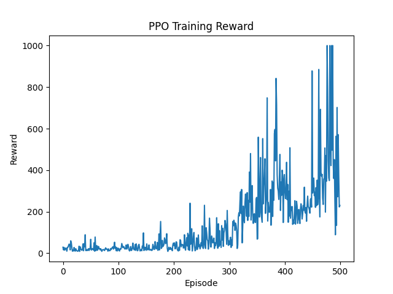

# Method
[PPO](https://en.wikipedia.org/wiki/Proximal_policy_optimization) is an on-policy reinforcement learning algorithm that uses a surrogate objective function to optimize the policy. It is designed to be more stable and efficient than traditional policy gradient methods.

Similar to REINFORCE, PPO uses a policy network to learn the optimal policy. However, instead of using the return as the reward signal, PPO uses a clipped surrogate objective function that limits the change in the policy at each update step. This helps to prevent large updates, which can stabilize training and improve performance.


# Running the code
Ensure the requirements are installed (see requirements.txt in the root project directory).

```bash
python PPO.py
```

## Workshop

For those of you following along with the workshop, you can find the slides [here](https://github.com/GersiD/Presentations/blob/main/archived/ppo_workshop/main.pdf).

The starter code 'PPO_starter.py' contains the scaffolding for the PPO algorithm, including the policy network architecture and the training loop. The update function is where you will implement the PPO update step, which involves calculating the surrogate objective and performing gradient ascent to update the policy network. See the "TODO" comment in the code for guidance.

Go ahead and run the starter code and see how it performs. Then implement the update function in the PPO class, the
starter code will output a plot of the rewards per episode, and you should see a relatively steady improvement in the rewards as you train the agent. You can also experiment with different hyperparameters, such as the learning rate, batch size, and clipping parameter, to see how they affect the performance of the agent.

An example of the rewards per episode plot for the working implementation of PPO is shown below, note that the rewards should steadily improve as the agent learns to navigate the environment, however due to the stochastic nature of the environment and the learning process, there may be some fluctuations in the rewards.


